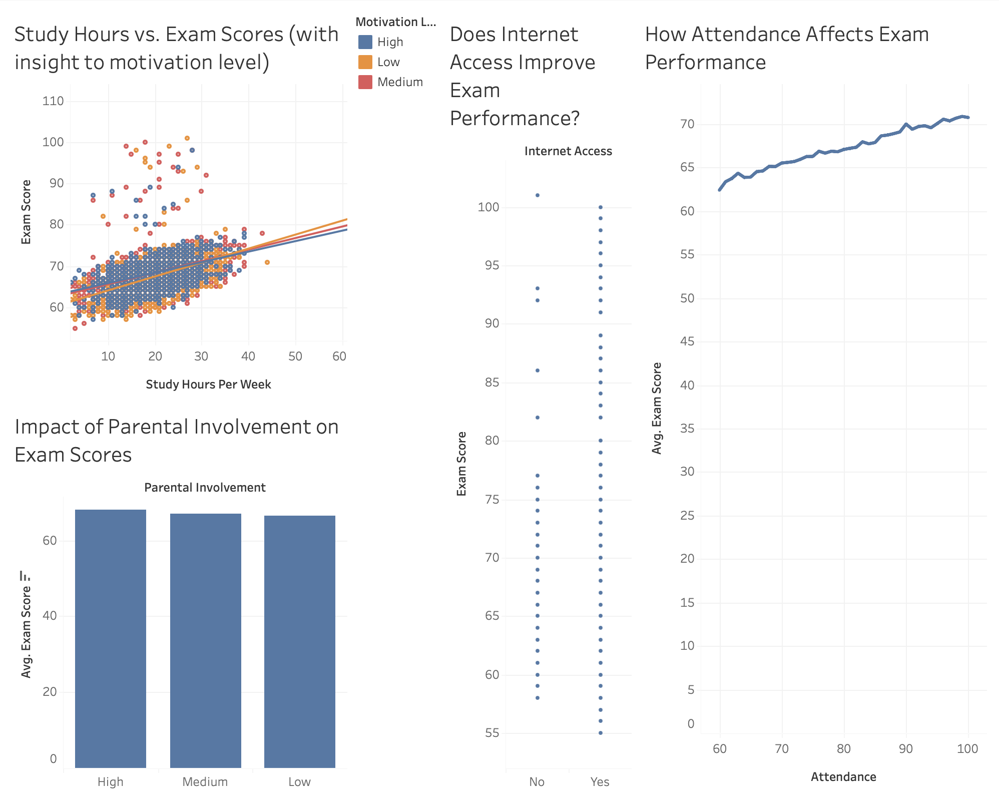

# Student Analytics Dashboard

## Overview
Tableau dashboard visualizes **student analytics trends**, including performance metrics, engagement rates, and key insights.

## View the Interactive Dashboard
Click the link below to explore the interactive dashboard on Tableau Public:

🔗 [View on Tableau Public](https://public.tableau.com/app/profile/vignesh.dinesha/viz/StudentPerformanceAnalyticsDashboard/Dashboard1)

## 📷 Dashboard Preview

**Explore filters and interactive elements** to analyze different data points.
**Hover over visualizations** for deeper insights.

## 📊 Key Insights from the Data

Analyzing student performance trends, we discovered several interesting patterns regarding study habits, motivation levels, internet access, and parental involvement:

### **📈 Study Hours vs. Exam Scores:**
- There is a **positive correlation** between study hours per week and exam scores.
- **Motivation Levels & Consistency:**  
  - High-motivation students exhibit **tighter clustering** in the trend graph, indicating more consistent performance.  
  - Medium-motivation students show slightly more variance, while low-motivation students are **widely spread**, reflecting inconsistent results.  
- **Impact on Performance Gains:**  
  - When plotting **lines of best fit** for different motivation groups, students with **low motivation** show the **steepest improvement** in exam scores as study hours increase.  
  - Medium-motivation students also benefit, but their correlation is slightly weaker.  
  - High-motivation students display the lowest correlation, suggesting their baseline performance remains relatively stable.  
  - While **motivation levels don’t drastically alter** the correlation between study hours and exam scores, the **distribution and consistency of performance vary significantly.**

### **🌐 Internet Access & Exam Scores:**
- Internet access plays a **critical role** in academic performance.
- Students with internet access are **4 times more likely** to score above 80 compared to those without.

### **👨‍👩‍👧 Parental Involvement & Exam Scores:**
- Higher parental involvement results in **slightly higher exam scores**, with an **average difference of just under 2%** between students with high vs. low parental engagement.

### **📅 Attendance & Exam Performance:**
- Attendance has a **near-linear relationship** with exam scores, indicating a **direct impact** of class participation on academic success.

These insights highlight the significant role of **study habits, motivation, external resources, and attendance** in student performance. While motivation influences consistency, internet access and attendance appear to have the **strongest measurable impact** on exam success.
